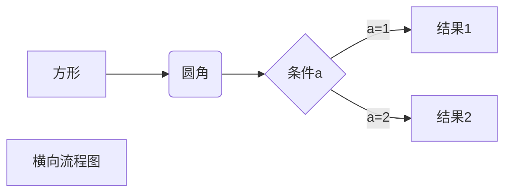

[toc!]

```sequence
小明->小李: 你好 小李, 最近怎么样?
Note right of 小李: 小李想了想
小李-->小明: 还是老样子
```


***

两篇学习教程，两个在线工具  
https://www.runoob.com/markdown/md-tutorial.html  
http://www.markdown.cn/#overview    
https://tool.lu/markdown/  
http://markdown.xiaoshujiang.com/  

***
# 1 标题-------


=分割为一级标题
=
-分割为二级标题

# 用#标记一级标题
## 用##标记二级标题
...

***总结：用#号写各级章节标题，可以用=和-写总标题，副标题（名字时间啥的）***
***


# 2 段落格式-----

### 换行
换行两个空格加换行  
换行根据两个换行

新行。这两个换行还是不太一样的。

### 字体----
*斜体文本*
_斜体文本_

**粗体**
__粗体__

***斜粗体***
___斜粗体___

### 分割线
用三个*-_就可以。可以加空格
***

* * *

*****

- - -

----------
都行。上下要加上换行。

### 删除线
~

### 注脚
使用时\[^要注明的文本]

后面解释 \[^要注明的文本]:解释

创建脚注格式类似这样 [^我的注解]。

[^我的注解]:学的不仅是技术，更是梦想！！！

***总结：段落换行用两个回车，段内想换行就两个空格+回车。  字体用\*,开头不能有空格，中英文都可以。  用换行加独立的3个\*表示分隔线。  删除线用 ~ ~括起来~。   下划线underline用 \<u>括起来\</u>。***

***

# 3 列表

1. 起床
	* 早饭
	* 写论文
2. 午饭
	+ 分日
	+ 啊
3. 睡觉


***总结：无序列表，用\*，+，\-都行。有序的是数字加\. 可以穿插使用***
***

# 4 区块

>区块
>* a
>* b
>>二区
>>1. a
>>2. b
>>3. c
>>>三区

### 使用技巧

1. 第一步
	>具体步骤
	>...
	>具体步骤

2. 第二步

***总结：多层区块，用\>分层。列表搭配分区块使用更配。***
***

# 5 代码
行间代码标注用反引号包围 \`
代码片段用一个tab缩进
或者用三个反引号包围，并且可以再第一行标注语言
\```python
print("hello")
\```
```python
print("hello")
```

# 6 链接
中括号和小括号组合，为链接名字和链接地址。
尖括号直接就是地址
[个人网站](https://www.liyue.site)
<https://www.liyue.site>


# 7 图片
感叹号加上方括号，圆括号。方圆语法就是链接的语法，方括号为替换文字，圆括号为地址。云括号里面还可以加上title属性


# 8 列表
用竖线分割不同的单元格，用\-分割表头和其他行。在用\-分割时，加上\:来表示对齐方式。


|title1 | title2| title3
|---:| :---:| :----
|1 | 2| 3

和latex类似

# 9 其他元素

支持HTML元素
目前支持的 HTML 元素有：\<kbd> \<b> \<i> \<em> \<sup>\<sub> \<br>等 

公式支持双美刀符，latex语法（段间公式）
问答和文章页会根据需要加载Mathjax对数学公式渲染

$$
a = \frac{a}{b}
$$

$$
\mathbf{V}_1 \times \mathbf{V}_2 =  \begin{vmatrix} 
\mathbf{i} & \mathbf{j} & \mathbf{k} \\
\frac{\partial X}{\partial u} &  \frac{\partial Y}{\partial u} & 0 \\
\frac{\partial X}{\partial v} &  \frac{\partial Y}{\partial v} & 0 \\
\end{vmatrix}
${$tep1}{\style{visibility:hidden}{(x+1)(x+1)}}
$$

# 10 流程图、时序图、甘特图
https://www.runoob.com/markdown/md-advance.html 的最下面一篇笔记
需要 Typora编辑器的源代码模式才支持。给提提建议吧。

但是小书匠可以根据标题生成思维导图，插入图片




